#Teoria.

En primeras instancias se procede a realizar una breve introducción del trabajo propuesto por la cátedra, el mismo, plantea que la computación en la nube es un modelo informático popular debido a su eficiencia en costos, escalabilidad y seguridad. Se basa en el acceso a recursos compartidos configurables a través de Internet. La tecnología de virtualización, que crea instancias de máquinas virtuales, desempeña un papel clave.

Las máquinas virtuales, gestionadas por un hipervisor, son esenciales para la gestión de cargas de trabajo en centros de datos y nubes. La virtualización del servidor garantiza rendimiento y seguridad al ejecutar máquinas virtuales completas en un sistema operativo host. La firmeza del aislamiento asegura que cada máquina virtual funcione sin conocer otras en la misma máquina física.

Dicho esto, se propone implementar diferentes escenarios con diferentes tipos de sistemas, como M/M1, M/M/1/C y M/M/k/k, en donde estos son modelos matemáticos utilizados en teoría de colas para analizar el rendimiento y el comportamiento de sistemas de espera, representados por notaciones de Kendall. Cada letra en la notación representa una característica específica del sistema. Es decir por ejemplo, un sistema M/M/k/k, significa:

1) M: Indica que la llegada de solicitudes al sistema sigue un proceso de Poisson, lo que significa que las llegadas son aleatorias e independientes en el tiempo. La tasa de llegada se denota como λ (lambda).
2) M: Representa que el servicio de las solicitudes sigue un proceso de Poisson, similar a la llegada. La tasa de servicio se denota como μ (mu).
3) k: Representa el número total de servidores disponibles en el sistema.
4) k: Indica la capacidad máxima del sistema, es decir, el número máximo de solicitudes que pueden estar en el sistema simultáneamente.

Para esto, se implementaron máquinas físicas y máquinas virtuales, para poder simular los distintos modelos antes nombrado, en el Paper descrito, realiza una pequeña introducción de las respectivas herramientas utilizadas para la implementación del mismo.

Una máquina virtual (VM, por sus siglas en inglés) es un entorno de ejecución virtual que opera como una computadora independiente dentro de otra computadora física. En lugar de depender directamente del hardware subyacente, una máquina virtual se ejecuta en un software de virtualización que simula el hardware y proporciona un entorno completo del sistema operativo. Esto nos da diferentes “ventajas” como por ejemplo, independencia de hardware, aislamiento, portabilidad, e incluso poder realizar desarrollos y pruebas.

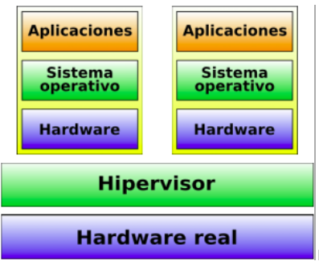

Cabe destacar que existen diferentes propuestas de MV, entre estas se destacan VirtualBox,VMware Player (Windows, Linux), VMware Fusion (Mac OS X) y Parallels Desktop, e incluso Kernel-based Virtual Machine o KVM, es una solución para implementar virtualización completa con Linux. Dentro de una máquina virtual (VM), puedes realizar una amplia variedad de tareas y actividades, ya que la VM simula un entorno de computadora independiente dentro de tu sistema host, por ende es posible instalar diferentes distribuciones de sistemas operativos, diferentes aplicaciones y programas e incluso se pueden crear contenedores utilizando tecnologías de contenedorización como Docker. Los contenedores son entornos ligeros y portátiles que contienen aplicaciones y sus dependencias, permitiendo que se ejecuten de manera consistente en diferentes entornos, permite ejecutar aplicaciones y sus dependencias de manera aislada, pero sin la necesidad de virtualizar un sistema operativo completo. Todo comienza con las imágenes del contenedor. Una imagen es un paquete ejecutable ligero que incluye código, bibliotecas, configuraciones y cualquier otra cosa necesaria para que la aplicación se ejecute. Las imágenes se crean a partir de un archivo llamado Dockerfile.

También existe lo que se denomina el motor de contenedores, como Docker, es responsable de construir, ejecutar y gestionar contenedores. Proporciona una interfaz de línea de comandos y una API que permite a los usuarios interactuar con contenedores y gestionar imágenes. Cuando se inicia un contenedor, se crea una instancia para la ejecución de una imagen. Esto se llama "crear un contenedor a partir de una imagen", las imágenes de contenedor suelen almacenarse en un registro, como Docker Hub. Esto facilita la distribución y el uso compartido de imágenes entre diferentes sistemas y equipos. 
Las imágenes pueden tener múltiples versiones y etiquetas, lo que permite a los desarrolladores y operadores gestionar las versiones de las aplicaciones y realizar actualizaciones controladas.

Por otro lado, cabe destacar como se ha mencionado en la sección de “Introducción” en el sitio presente, se plantea una forma de tratar de elaborar y de replicar  el Paper, antes mencionado, dicho esto, para la implementación del mismo se utilizó el concepto de Cluster,  el mismo, es un conjunto o grupo de computadoras interconectadas que trabajan juntas para realizar tareas o funciones específicas como si fueran una sola entidad. Los clústeres son utilizados para mejorar el rendimiento, la disponibilidad y la escalabilidad de sistemas informáticos. Para replicarlo, se utilizó más precisamente kubernetes, comúnmente conocido como "K8s", es una plataforma de código abierto diseñada para automatizar la implementación, el escalado y la gestión de aplicaciones en contenedores, en donde a partir del mismo se pudo orquestar contenedores, realizar escalado y despliegue, ya que permite escalar automáticamente la cantidad de réplicas de una aplicación en función de la carga de trabajo. También facilita el despliegue de nuevas versiones de aplicaciones sin tiempo de inactividad, gestionar recursos, automatizar tareas, entre otras cosas. 

En el Papers, se plantea un modelo de cola para aplicaciones en la nube que asegura el rendimiento incluso con cargas de trabajo dinámicas. Su enfoque implica la migración de contenedores en tiempo de ejecución para cumplir con los tiempos de respuesta requeridos. A diferencia de otros informes, en este, no sólo predicen la carga de trabajo, sino también la demanda futura de recursos. Su modelo proporciona detalles adicionales al proveedor de la nube sobre cuándo y cómo escalar o desescalar los contenedores. El modelo considera escenarios realistas, con múltiples máquinas virtuales en una máquina física y varios contenedores en una VM. Las solicitudes de tareas se envían a través de un equilibrador de carga y se almacenan en un búfer conectado a la cola de equilibrio para la asignación de recursos. Se establece un Acuerdo de Nivel de Servicio (SLA) entre los usuarios y el proveedor de servicios en la nube (CSP) para determinar la Calidad de Servicio (QoS).En resumen, las solicitudes de tareas se distribuyen uniformemente entre las máquinas físicas en el centro de datos en la nube (CDC). Cada tarea se asigna a un contenedor único, y en caso de una alta demanda, se amplía el CDC agregando contenedores según sea necesario.

Para modelar el Centro de Datos en la Nube (CDC), se emplea una red de colas abierta de Jackson, en donde la red de colas abierta de Jackson, es una herramienta matemática utilizada para modelar sistemas donde las unidades fluyen continuamente a través del sistema y pueden ser atendidas en un orden específico. En el contexto del Papers, se aplica para entender la dinámica de las solicitudes de usuarios, las máquinas físicas y los contenedores en el Centro de Datos en la Nube (CDC). Se asume que todas las Máquinas Físicas (PM) en el CDC son iguales, y las solicitudes de los usuarios en cada cola en cualquier nodo del CDC se manejan según una política FIFO. Después de completar el servicio, las solicitudes abandonan la PM y salen del sistema. Cada solicitud de usuario se considera una unidad mínima de cómputo (tarea) en el CDC y solo puede ejecutarse en un contenedor. Los tiempos de servicio en el servidor del equilibrador de carga siguen una distribución exponencial con un parámetro de tasa μ, donde 1/μ representa el tiempo medio de servicio.

A continuación se procede a visualizar el diagrama del proyecto propuesto por el Paper:


Algunas de las fórmulas aplicadas para la resolución de la primer parte (teórica) del proyecto, son las siguientes:

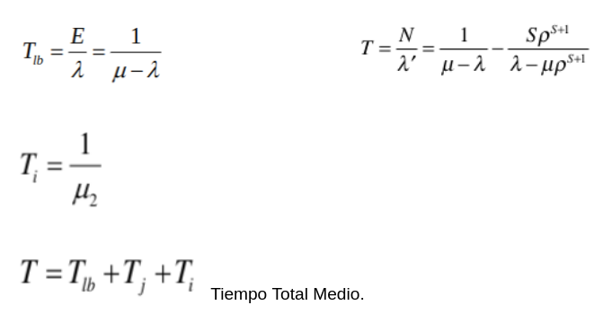

También se utilizaron las ecuacioens para calcular la probabilidad de pérdida de cada sistema: 

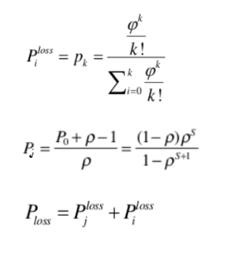

Ecuacion para calcular la utilizacion del CPU dehardware fisico:

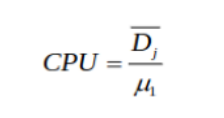

Dicho esto, se realizó la implementación por medio de JupyterNotebook:
Teniendo en cuenta la siguiente tabla.

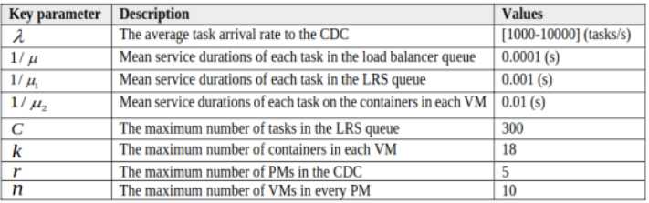

Se procede a analizar y a visualizar las gráficas obtenidas con el código propuesto, cabe destacar que en el trabajo del Paper, se realizó una implementación similar analizando las diferentes gráficas que a continuación se detallan. En primeras instancias se procedió a analizar y a ir variando la cantidad de máquinas físicas, para corresponder con el Papers.

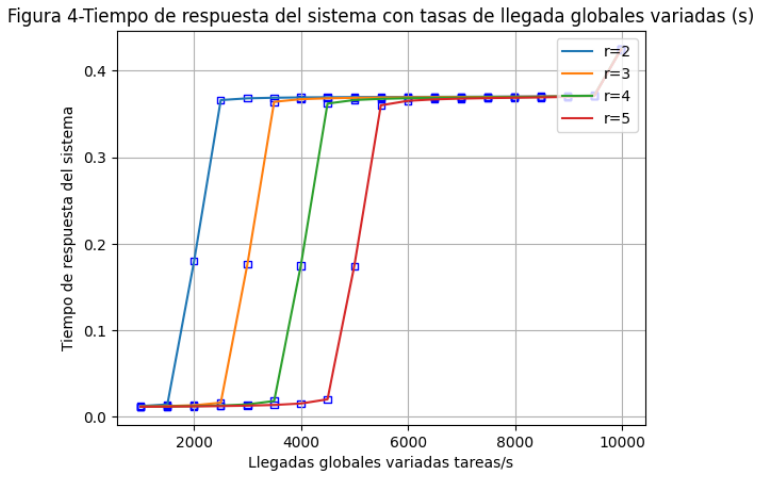

Aquí se puede visualizar cómo varía el tiempo de respuesta del sistema, en función de cómo van llegando las distintas peticiones, se observa un cambio de tiempo cuando ingresan 9500 peticiones/segundo, observamos que el tiempo de respuesta supera incluso los 0.4 segundos. 

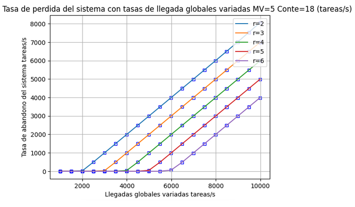

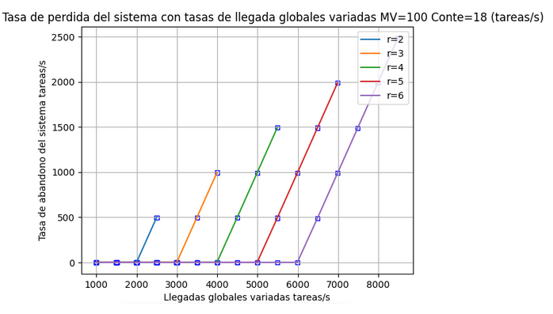

Aquí se observa la cantidad de abandonos que está teniendo el sistema al realizar las diferentes prueba, en primeras instancias la línea azul, corresponde a 2 máquinas físicas, la naranja 3 máquinas físicas, la verde 4, la roja 5 y la violeta 6, se observa que obviamente la cantidad de paquetes perdidos disminuye al aumentar la cantidad de máquinas físicas, esto se debe a que el sistema puede procesar más información, si se producen pérdidas al disminuir la cantidad de máquinas físicas, se debe a que las peticiones no se procesan y que los buffers lo limitan. A continuación se fueron realizando diferentes pruebas, ya sea variando la cantidad de contenedores por MV, como la cantidad de MV.

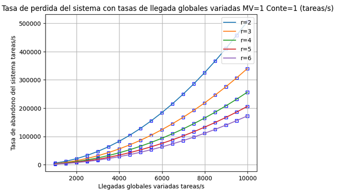

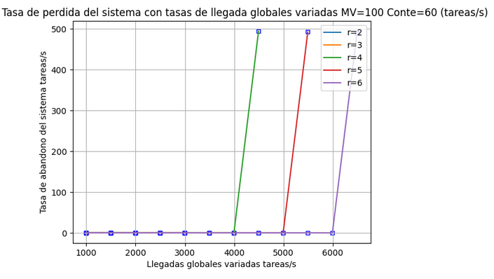

En las siguientes figuras se puede observar la capacidad de cómo el sistema procesa los diferentes pedidos:

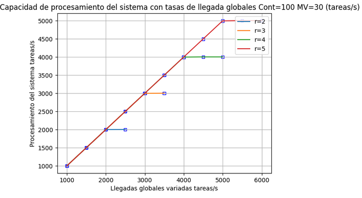

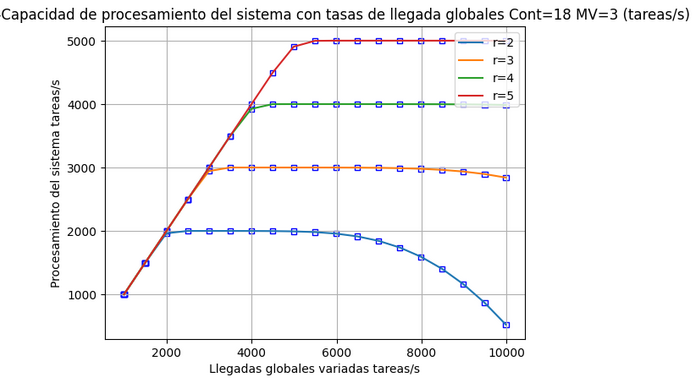

Podemos observar como el sistema al bajar la cantidad de contenedores y de máquinas virtuales, comienza a perder procesamiento.

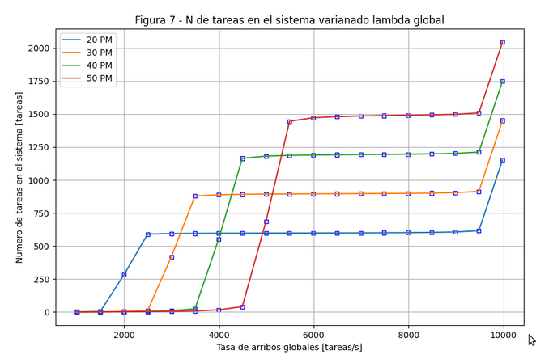

Podemos observar que en la gráfica 7,  a medida que aumentamos la tasa de arribo, la cantidad de tareas en el sistema  tiende a aumentar, ya que la tasa de servicio es constante, hasta un punto en donde se hace exponencial, esto se debe a que la cantidad de arribos es igual a la cantidad de tasa de servicio es decir, el rho se hace 1, por ende el sistema se hace inestable y los valores comienzan a divergir a valores muy grandes.

En la siguiente gráfica observamos como se estresa el CPU en función de las tareas llegadas al sistema, podemos visualizar que aumentando la cantidad de máquinas físicas, aumenta la capacidad de procesamiento del sistema, vemos que al introducir 5 máquinas físicas el porcentaje de CPU llega al 100% cuando la cantidad de llegadas son de 4000 tareas/segundo, y cuando tenemos 1 máquina física el sistema se satura en 1500 tareas/segundo. 

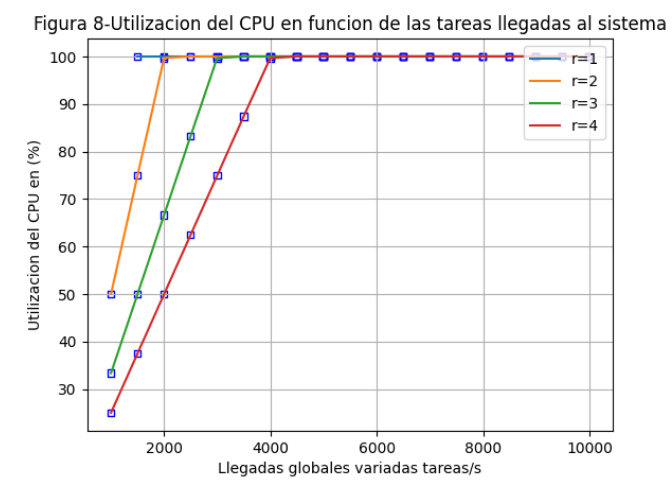

Si nos planteamos aumentar la cantidad de máquinas físicas, podemos ver que la cantidad de tareas globales por segundo serán mucho mayor, para un mismo valor de utilización de CPU.

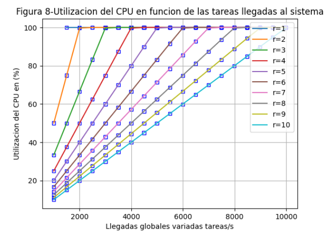

Podemos visualizar a continuación cómo responde el sistema al variar la cantidad de contenedores, es decir como disminuye el tiempo de respuesta al aumentar la cantidad de contenedores, observamos que al aumentar la cantidad de máquinas físicas, el tiempo se reduce considerablemente.

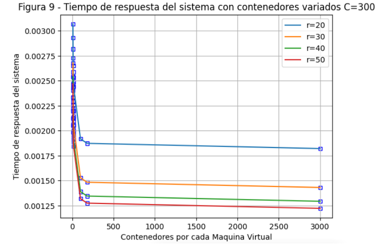

La siguiente figura ilustra cómo el sistema puede escalar dinámicamente los recursos  asignando un número de contenedores para cumplir con un tiempo de respuesta de SLA deseado.

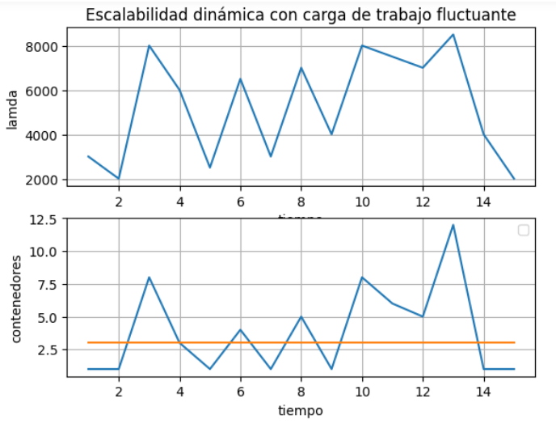


#Implementacion.

Una vez concluido el análisis del Paper, se procedió a la implementación del proyecto. Utilizando kubernetes de minikube y administrado con kubectl, con los correspondientes archivos .yaml. También se utilizó haproxy, y FastApi con uvicorn.

La implementación se hizo en el laboratorio de redes, en una red lan cableada.

El esquema es el siguiente:

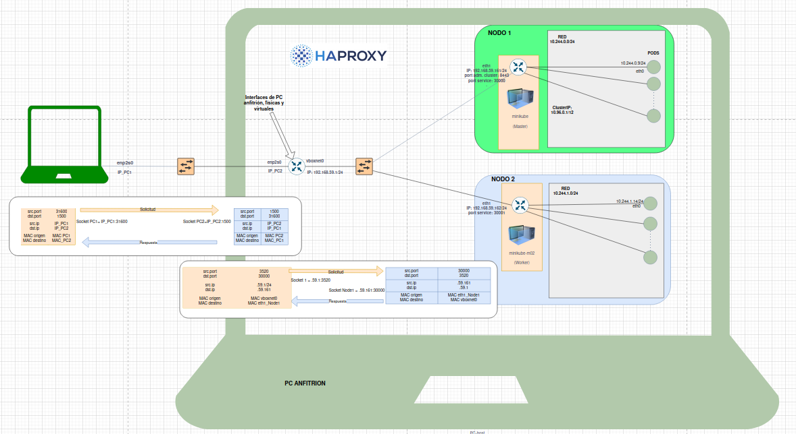

Se observa, por un lado, el cliente en una máquina física, y por otro, el balanceador de carga con los nodos y pods en otra máquina física.

##Generador de Trafico.

Como primeras instancias, se procede a la realización de un script de python para poder implementar la generación de tráfico, ósea definir la cantidad de usuarios como también la tasa de arribo, cabe destacar que la tasa de arribo total, es teniendo en cuenta el producto de la cantidad de usuarios por el lambda. Básicamente el código consiste en una parte principal en donde la misma resuelve la dirección IP, el puerto, el número de clientes y el valor de lambda, para  luego generar tráfico. 

La función `send_request` envia solicitudes get asíncronas a la URL especificada y mide el tiempo que tarda en recibir la respuesta.

La función `generate_traffic` genera tráfico simulando la llegada de solicitudes de manera exponencial, osea que cada usuario espera un tiempo determinado antes de enviar una solicitud y luego ejecuta la función `send_request`.

La función `main` configura los parámetros del servidor, solicitando la cantidad de usuarios y el valor de lambda. Después se configura el límite de conexiones y se ejecutan las tareas de generación de tráfico para cada usuario usando asyncio.gather.

##HAProxy.

HAProxy es un software de código abierto que actúa como un balanceador de carga y proxy TCP/HTTP, diseñado para mejorar la disponibilidad y confiabilidad de aplicaciones o sitios web al distribuir el tráfico entre múltiples servidores.

Se utilizó el algoritmo Round Robin para distribuir equitativamente las solicitudes de clientes entre los servidores disponibles. En este método, cada solicitud se asigno secuencialmente a los servidores en un ciclo continuo. Por ejemplo, si tienes tres servidores (S1, S2, S3), las solicitudes se distribuirán en orden: S1, S2, S3, S1, S2, y así sucesivamente. Como en nuestro caso tenemos 2 servicios diferentes declarados, haproxy redirecciona las solicitudes una y una a cada servidor.

Aunque el Round Robin ofrece una distribución justa, no considera la carga real de los servidores.

Pasamos a desarrollar una breve explicación del código utilizado. Este código configura HAProxy como un balanceador de carga y proxy HTTP. En la sección de configuración global, se definen parámetros como logs, directorio raíz y opciones SSL. La configuración por defecto establece opciones globales, incluyendo el modo HTTP, configuración de logs y tiempos de espera. Se establecieron 2 frontends configurados: "http_web" escucha en el puerto 1500, manejando tráfico HTTP y enviándolo al backend "milu". El frontend "stats" escucha en el puerto 1234, proporcionando estadísticas accesibles a través de la `localhost/haproxy-stats`. El backend "milu" opera en modo HTTP, utilizando el algoritmo Round Robin para distribuir equitativamente el tráfico entre dos servidores, "serv1" y "serv2", en puertos específicos. Además, se agrega la dirección IP del cliente al encabezado de la solicitud y se configuran opciones de verificación para los servidores.

##Kubernetes.

Kubernetes simplifica la administración de aplicaciones en entornos contenerizados, proporcionando herramientas para la gestión de recursos, la resiliencia y la escalabilidad. Su popularidad se debe a su capacidad para gestionar de manera eficiente la implementación y operación de aplicaciones distribuidas y microservicios en entornos de producción.

En nuestro caso, se implementó kubernete, más precisamente Minikube, en donde el mismo se realizó en 1 PC física. Para simular los respectivos clusters, se levantaron en ella, dos máquinas virtuales, es decir 2 NODOS, esto es por una cuestión de recursos de hardware, ya que al estresar demasiado las PC disponibles en los laboratorio, las mismas, comenzaban a “congelarse” y no era eficiente el proyecto, lo eficiente hubiera sido poder constatar y visualizar los experimentos levantando más de 2 nodos.

Resulta oportuno mencionar, que se levantaron más de 2 PODs, por nodo, con el fin de ir comprobando cada una de las respectivas conclusiones, como por ejemplo ver si el sistema implementado tenia perdidas o no, si las hubiese habido donde, (vimos que no existen pérdidas, y esto por el protocolo orientado a conexión de TCP, ya que el mismo, no permite o hace más eficiente y confiable el sistema), también poder observar la latencia, poder definir y observar los stack de protocolos. En el caso de Minikube se pudo interactuar dentro de las PCV como también, dentro de cada uno de los respectivos PODs.

En esta implementacion, para seguir lo mas que se pueda el diagrama del paper, se crearon dos servicios diferentes pero que en realidad son los mismos ya que utilizan la misma aplicacion. Se declararon como dos aplicaciones diferentes, cada una asociada a un servicio y ademas se indico que cada una apunte solo a un nodo especifico. Con esto logramos que minikube no distribuya trafico entre los nodos. Como se puede observar en los archivos deployment.yaml, en la linea de "nodeSelector" se declara a cual nodo apuntara cada servicio.

```bash
apiVersion: apps/v1
kind: Deployment
metadata:
  name: depokevina  #nombre de la app
spec:
  replicas: 1
  selector:
    matchLabels:
      role: php-kevin-a
  template:
    metadata:
      labels:
        role: php-kevin-a
    spec:
      nodeSelector:
        kubernetes.io/hostname: minikube
      containers:
      - name: php-kevin
        image: bocha2002/servidor_exp_time:latest
        imagePullPolicy: IfNotPresent
        ports:
        - containerPort: 8000
        command: ["/bin/sh", "-c", "uvicorn servidor_exp_time:app --host 0.0.0.0 --port 8000"]
        env:
        - name: MYSQL_ROOT_PASSWORD
          value: "password"
        resources:
          requests:
            memory: "64Mi"
            cpu: "200m"
          limits:
            memory: "128Mi"
            cpu: "500m"
```


