#Pruebas.

Para poder continuar con el proyecto abordado, se presentan a continuación las diferentes pruebas que realizamos con el grupo de trabajo, en las mismas, se utilizaron diferentes software y aplicaciones para poder generar tráfico y poder visualizarlo. 

En cuanto a las capturas obtenidas, podemos observar pruebas tanto de conexión como también de sniffer con el programa Wireshark, en donde en el mismo se visualizan que no hay pérdidas de peticiones, también se analizaron los distintos stack de protocolos, y la encapsulación pertinente. Podemos concluir que el software, es interesante al momento de la visualización de los arribos al sistema planteado, ya que se puede ir “filtrando” los diferentes preguntas y respuestas del Cliente al Servidor, cabe destacar que también se realizaron pruebas de cómo van variando el tiempo medio de arribo de las peticiones por medio de consola.

En una primera instancia necesitabamos observar como variaba la tasa de arribo al estresar sistema, para determinar hasta qué punto era capaz de resolver las peticiones según la cantidad de PODs presentes en cada uno de los nodos. Se adjuntan imágenes del mismo, en donde podemos observar como varían en función de la cantidad de PODS.

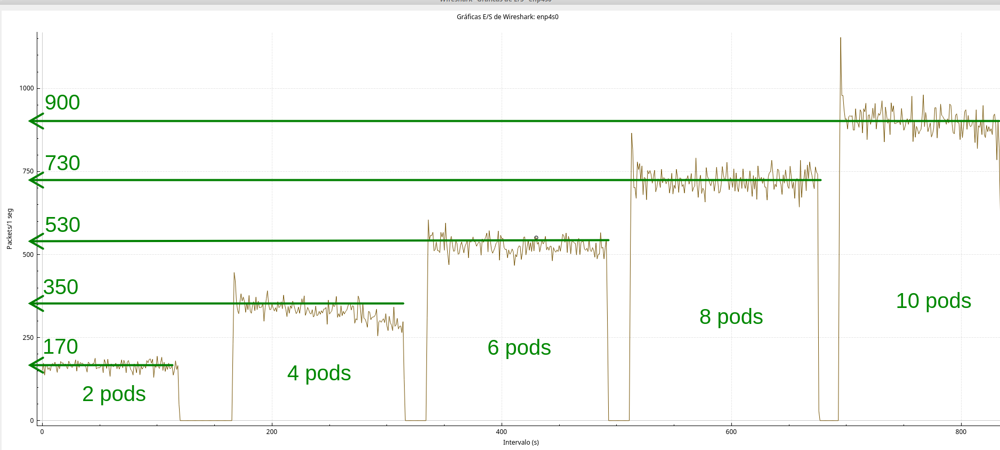

Para 2 pods tenemos una tasa de arribo de 160 en promedio, dividido entre los 2 pods, da 80 solicitudes por pod.

A continuación se detallan las fórmulas utilizadas para la resolución de los cálculos pertinentes:

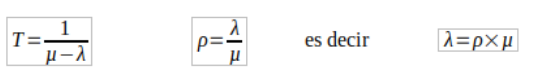

Suponiendo en la teoria que cada servidor tiene una tasa de servicio de 100, y teniendo en cuenta que disponemos de 2 pods, tendriamos un mu = 200. Con este valor procedemos a calcular el tiempo teorico en funcion del lambda. En la siguiente tabla vemos el Tteorico calculado y el Treal medido en funcion de lambda:

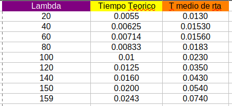

Podemos ver que para un mismo valor de lambda se tiene un tiempo real del sistema mayor que el teorico calculado. Consideramos que esto se debe a que no tenemos en cuenta el tiempo que le lleva a las aplicaciones de python ejecutar una tarea, asi como tambien el tiempo de retardo que ocaciona el control de flujo de TCP al poner a las solicitudes en bufer.

En la siguiente figura podremos visualizar los mismos datos de la tabla:

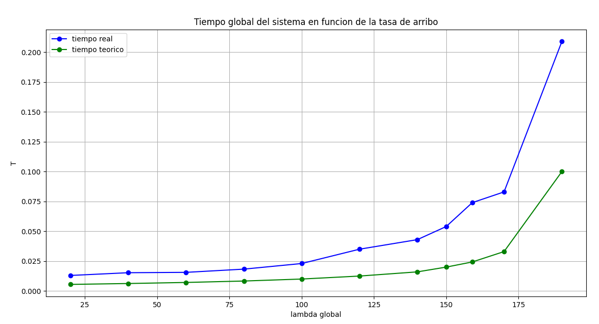

Ahora procedemos a calcular el valor teorico del rho para compararlo a un rho mas cercano a lo real. Para el rho teorico utilizamos un mu = 200 y fuimos variando lambda. Para el rho "real" utilizamos el valor de mu = 160 que determinamos mas arriba.

Estos datos los plasmamos en la tabla de abajo:

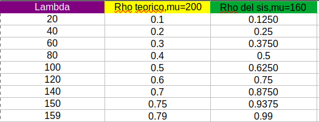

Observamos, en la siguiente figura, que para un mismo valor de lambda tenemos una tasa de utilizacion real de todo el sistema mayor a la tasa teorica, o rho teorico. Esto es debido a que la tasa de servicio real que promediamos (160) es menor que la teorica.  

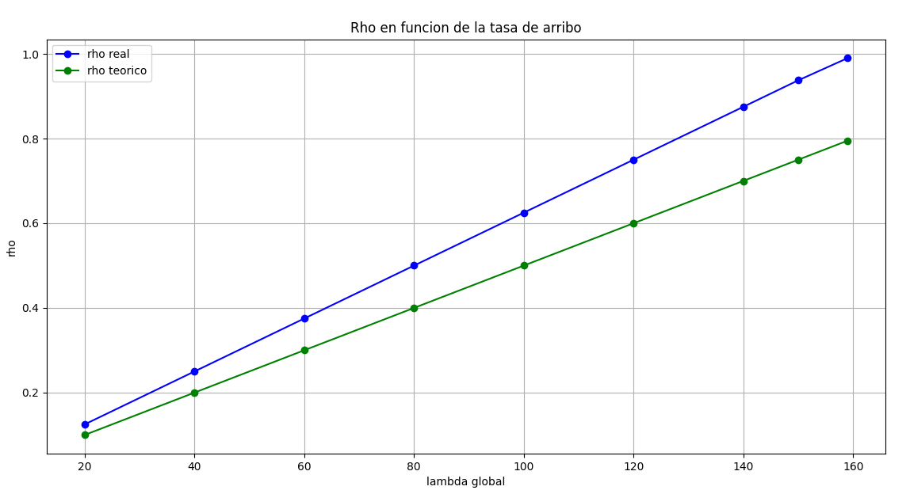

Otro analisis que nos parecio pertinente destacar es analizar el redireccionamiento roundrobin de HAProxy, ya que al declarar los servicios como nodeport y crear dos servicios, uno asociado a cada nodo, el encargado de hacer el balanceo de carga sera haproxy. Es decir, se debe ver que la mitad de los paquetes son enviados a un nodo y la otra mitad al otro nodo.

Desde el cliente:

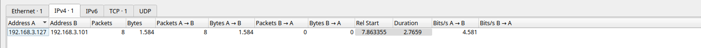

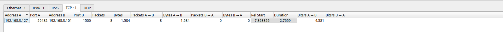

Se puede ver que hay un solo socket en el cliente y se envian 8 paquetes por ese socket.

Desde el lado del servidor, en su interfaz fisica enp4s0:

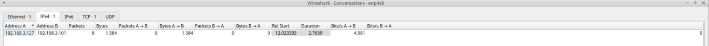

Si se observan los sokets en la seccion de TCP se vera que tambien utiliza un solo socket para recibir los paquetes.

Ahora si snifeamos en la interfaz virtual del servidor, vboxnet0, podremos ver las comunicaciones entre la interfaz con direccion ip `.59.1` y los nodos. Algo que se diferencia rapidamente es que del lado del backend se deben tener como minimo 2 sockets, y es lo que observamos en las siguiente imagenes:

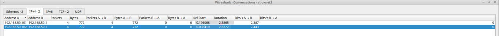

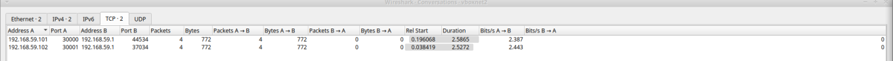

 

 
 
