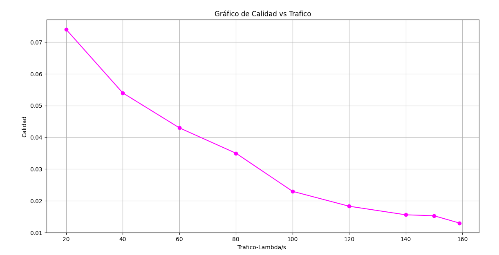

#Conclusiones

Como conclusiones generales, podemos decir que se establecieron con éxito ambas partes de elaboración, tanto para la parte del Paper, como también la parte física. En cuanto al Paper, pudimos sacar diferentes conclusiones detalladas con anterioridad, pero la idea general de cómo varían los sistemas al aumentar la cantidad y calidad de procesamiento fue aplicada con éxito, más allá de las diferencias con el mismo, se pudo constatar cómo afecta la cantidad de tráfico según el tipo de sistema que tengamos presentes al variar la cantidad de máquinas físicas, virtuales o incluso la cantidad de contenedores presentes en el sistema. También se pudo visualizar las pérdidas producidas al disminuir la cantidad de máquinas físicas, esto es por el tamaño del buffer preestablecido, en el sistema de colas M/M/1/C como también en el de pura perdida M/M/k/k. Se llegó a la conclusión de que se necesita tener presente siempre el triángulo detallado con anterioridad de Capacidad del Sistema, Calidad, y Tráfico Ofrecido, ya que al variar, por ejemplo la cantidad de tráfico o el sistema, puede llegar a haber un cambio significativo en nuestra calidad.

En cuanto a la parte práctica, podemos decir, que no se llegó exactamente igual a las pruebas del Paper, consideramos que esto se debe a que obviamente existen ciertas latencias en los medios físicos, como también la implementación del protocolo de transporte TCP, en donde concluimos que por causa del mismo, no existieron pérdidas. Se pudo llegar a conocer ampliamente la capacidad que tienen sistemas como kubernetes y el potencial para poder desplegar Clusters sin la necesidad de recursos tan avanzados, pudimos concluir que es una herramienta muy eficiente. También se desarrollaron distintos códigos como se mencionó con anterioridad, de Python, tanto para el cliente como para el servidor, pudiendo observar e investigar las diferentes funciones que se utilizan para poder abordar diferentes necesidades para el desarrollo de Software. Se implementó el uso de la herramienta FastApi, con la cual se realizaron los servidores para poder ejecutarlo, esto llevó a tener que investigar sobre la misma.

A continuación realizamos un análisis de la capacidad,calidad y tráfico ofrecido.

En la siguiente grafica vemos la capacidad del sistema en funcion del lambda, teniendo un trafico fijo:

Se puede ver que la calidad del servicio crece linealmente si aumentamos la capacidad del sistema. Esto va a estar limitado por el hardware de nuestro cluster, va a llegar un punto donde no se podran levantar mas pods y la capacidad del sistema se mantendria constante.

Ahora veremos la calidad del servicio en funcion de la carga de trafico.

Al tener una capacidad de sistema fija, la calidad del sistema disminuira al aumentar la tasa de arribo.

Por ultimo tenemos la grafica de la calidad del servicio en funcion de la capacidad del sistema, dejando un trafico ofrecido fijo.

Si dejamos el trafico que llega fijo y aumentamos la cantidad de pods podemos notar que el tiempo medio de respuesta disminuye. Como podemos ver en la grafica de abajo:

