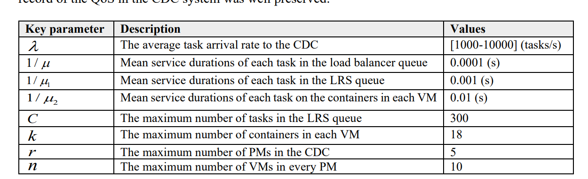
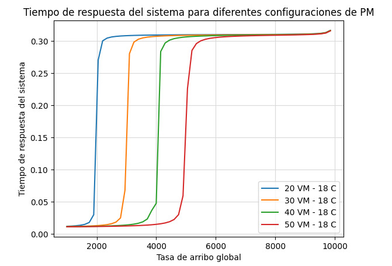
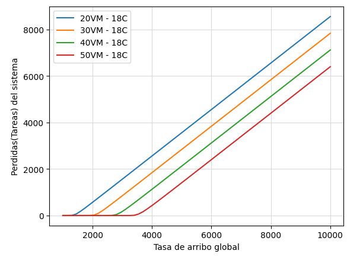
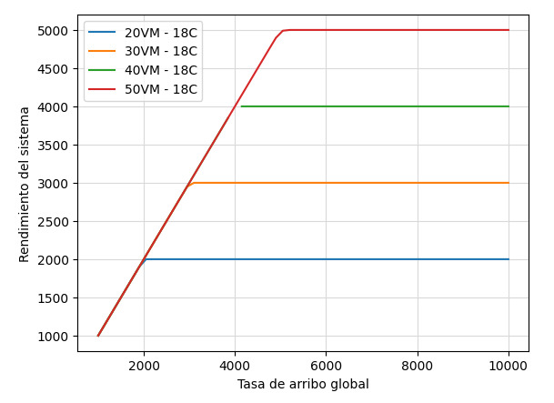
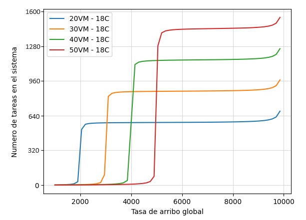
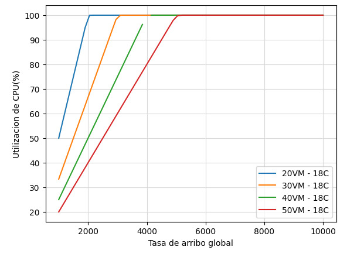

# Graficas primer Parcial - Conclusiones

Para realizar todas las graficas se utilizaron los siguientes parametros de la Tabla 1, propuestos por los autores del paper en sus experimentos.

Tabla 1: Parametros de simulacion con sus valores correspondientes   

#### Primera Grafica

Para este primer experimento, se evaluaron los distintos tiempos de respuesta que presenta el sistema en conjunto, a partir de variaciones en la cantidad de maquinas fisicas, lo que produjo variaciones en la cantidad total de maquinas virtuales (VM). En esta grafica, podemos observar que a medida que se aumenta la tasa de arribo en el sistema, se produce un aumento en el tiempo de respuesta de este. Ademas, se observa que no hay cambios importantes en los tiempos cuando se maneja una tasa de arribo global comprendida entre los 5500 tareas/seg y las 9500 tareas/seg. Sin embargo, cuando nos aproximamos a las 10000 tareas/seg podemos ver que en los 4 casos representados, se produce un aumento de manera exponencial en los tiempos de respuestas. 

#### Segunda Grafica

En esta grafica, se busca representar la cantidad de tareas perdidas en el sistema, a medida que se aumenta la tasa de arribo global de tareas. Aqui se puede observar que la cantidad de tareas perdidas aumenta a medida que se aumenta la tasa de arribo global. Se puede destacar que a medida que se aumenta la cantidad de maquinas virtuales, se disminuye la cantidad de tareas perdidas.

#### Tercera Grafica

En la grafica numero 3, se representa el rendimiento del sistema de los equipos utilizados por los autores del paper a medida que se aumenta la tasa de arribo global. Se puede observar que a medida que aumenta la cantidad de contenedores en el sistema (producto del aumento de maquinas fisicas, y por ende, de maquinas virtuales) se produce un aumento en el rendimiento total del sistema. Ademas, se puede observar que a partir de ciertos valores de tasa de arribo global, los valores de las graficas permanecen estables, por lo que en esos casos no se pueden procesar mas tareas/seg.

#### Cuarta Grafica

En la cuarta grafica, se representa el numero total de tareas en el sistema, a medida que se varia el numero total de contenedores. Aqui se puede observar que a medida que se usa un numero alto de contenedores, y si no se superan las 5000 tareas/seg, se puede obtener un numero alto de tareas dentro del sistema. En el caso de que se superen las 5000 tareas/seg en la tasa de arribo global, el cuarto caso (50 VM - 18 C) es el que puede alojar mayor cantidad de tareas totales. 

#### Quinta Grafica

En esta ultima grafica, se representa el porcentaje de utilizacion del CPU de los equipos de los autores del Paper, a medida que se aumenta la tasa de arribo global en el sistema. En esta grafica se observa que para los primeros casos graficados, se llega al 100% de utilizacion del CPU a menor cantidad de tareas/seg, a diferencia de los ultimos, para los cuales es necesaria una mayor cantidad de tareas para lograr el mismo resultado. Por lo tanto se puede concluir que aumentar el numero de maquinas virtuales, y por ende de contenedores, produce una disminucion en la carga que tiene los CPUs utilizados.