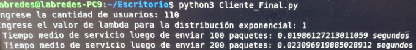

# RESULTADOS DEL EXPERIMENTO

# Tasa de servicio " &mu;"

Para realizar el experimento, se fue variando el numero de contenedores en el sistema y se obtuvo el tope de rps en cada caso. El resultado fue el
siguente:

**Fig.1 rps para sistema con 2 contenedores**

**Fig.2 rps para sistema con 4 contenedores**

**Fig.3 rps para sistema con 6 contenedores**

**Fig.4 rps para sistema con 8 contenedores**

En funcion de las rps vistas anteriormente, pudimos obtener el "&mu;es"  (tasa de servicio del sistema estimado) y el "&mu;p" (tasa de servicio estimado de cada contenedor) para cada sistema.

| cantidad contenedores en el sistema | &mu;es | &mu;p|
|------------|------------|------------|
| 2    | 155    | 77.5     |
| 4   | 355    | 88.75     |
| 6    | 600    | 100   |
| 8    | 790    | 98.75   |

# Tiempo medio de respuesta del sistema "T"

Para esta prueba utilizamos un sistema de 2 maquinas virtuales, cada una con un contenedor donde se ubicaba un servidor.

El objetivo de esta prueba fue contrastar los tiempos de respuesta obtenidos del experimento, con los tiempos de respuesta estimados.
## Formulas utilizadas 

**tasa de arribo del sistema**

$$
\lambda =\mu es*\rho
$$

&lambda; : tasa de arribo del sistema 

**tiempo medio de servicio en el sistema**

$$
T= \frac{1}{\mu es-\lambda}
$$

Te: tiempo estimado

Tr: tiempo real

**tasas de servicio**

$$
\mu es=155=77.5*c=77.5*2
$$

&mu;es: tasa estimada de servicio del sistema

c: cantidad de contenedores del sistema

Para cada uno de los casos que siguen, se establecio una carga y se determino el &lambda; del sistema para cumplir con ella.

**Caso 1**

Considerando una carga de
&rho;=0.129

$$
\lambda =\mu es*\rho=155*0.129=20
$$

El tiempo de respuesta estimado fue el siguiente:

$$
Te= \frac{1}{\mu  e-\lambda}=\frac{1}{\ 155 -\ 20}=0.007 [s]
$$

El resultado obtenido fue el siguiente: 

**Fig.5 Tiempo de respuesta para &lambda;=20**

**Caso 2**

Considerando una carga de
&rho;=0.709

$$
\lambda =\mu es*\rho=155*0.709=110
$$

El tiempo de respuesta estimado fue el siguiente:

$$
Te= \frac{1}{\mu  e-\lambda}=\frac{1}{\ 155 -\ 110}=0.02 [s]
$$

El resultado obtenido fue el siguiente: 

**Fig.6 Tiempo de respuesta para &lambda;=110**

**Caso 3**

Considerando una carga de
&rho;=0.387

$$
\lambda =\mu es*\rho=155*0.387=60
$$

El tiempo de respuesta estimado fue el siguiente:

$$
Te= \frac{1}{\mu  e-\lambda}=\frac{1}{\ 155 -\ 60}=0.01 [s]
$$

El resultado obtenido fue el siguiente: 

**Fig.7 Tiempo de respuesta para &lambda;=60**

## Tabla de resultados

|  &rho;| &lambda;| Te | Tr |
|---|---|----|----|
|  0.129 |20   |0.007    |   0.0152 |
|   0.25|   40| 0.008   |   0.0156 |
|  0.38 |   60|  0.01 |   0.0162 |
| 0.7096  |  110 |   0.02 |   0.0238 |
|  0.87 | 135  |  0.05  |   0.061 |
|   0.96|   150|  0.2  |   0.28 |
|  0.99 |   155| 1   |   1.06 |

## Graficas obtenidas

**Fig.8 Graficas de resultados obtenidos**

## caso &rho; > 1
En este caso, pudimos observar lo que pasaba con el experimento cuando habia sobrecarga en el sistema, lo cual  implicaba que se llegaba el "punto de saturacion". Como pudimos observar, los tiempos de respuesta divergian. 

**Fig.9 Rho mayor que 1**

# Perdida de solicitudes

El objetivo de esta prueba fue determinar si habia perdida de solicitudes en el sistema, comparando las sps con respecto a las rps

**Fig.10 Conteo de paquetes en wireshark**

# Balanceo de carga
Esta prueba se realizo con el fin de verificar si el balanceo se estaba haciendo de forma correcta

**Fig.11 resultado de balanceo de haproxy en wireshark**

