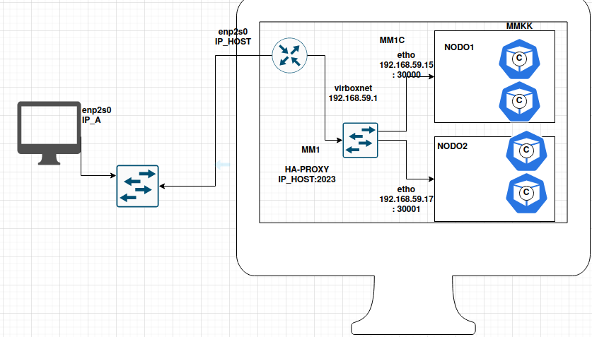

# MODELO TEORICO

Nuestro paper de referencia para hacer este trabajo proponía un modelo para el escalamiento dinámico basado en la teoría de colas para escalar recursos virtuales de contenedores y satisfacer los acuerdos de nivel de servicio (SLA) del cliente manteniendo los costos de escalamiento bajos. El objetivo era mejorar la utilización de los recursos informáticos virtuales y satisfacer las limitaciones del SLA en términos de utilización de la CPU, tiempo de respuesta del sistema, tasa de abandono del sistema, número de tareas del sistema y rendimiento del sistema.

# IMPLEMENTACION

En función del mismo, generamos el siguiente modelo teórico inicial mostrado en la Fig.1

**Fig.1 diagrama de red**

## Tecnologías requeridas

Para realizar estos experimentos, requerimos:

- Cliente.py: este fue un programa en Python que nos brindó la posibilidad de generar tráfico siguiendo tiempos de interarribo con distribución exponencial.

- Servidor.py: este fue un programa en Python que, junto con la utilización de FastAPI, nos permitió generar un servidor cuyo tiempo de servicio era gobernado por una constante agregada en el programa.

- Docker: fue una plataforma que nos brindó la posibilidad del uso de entornos ligeros y portátiles que incluyeron todo lo necesario para que la aplicación del servidor pudiera ejecutarse correctamente.

- Kubernetes: Kubernetes fue clave para este trabajo, actuó como una plataforma de orquestación que simplificó la administración, escalabilidad y despliegue de la aplicación del servidor. Para poder realizar el networking, hicimos uso de deployments y servicios. Los deployments fueron manifiestos que nos permitieron generar un conjunto de pods, seleccionar qué contenedor iban a albergar (en este caso, nuestro servidor) y qué nodo o máquina virtual iba a estar vinculado. Por otro lado, nos permitió crear servicios que posibilitaron la separación y aislación de los dos conjuntos de nodos y además el uso de "Node port" que nos brindaba un puerto externo para poder acceder a nuestros pods desde afuera.

- HaProxy: es un balanceador de carga, se dice que es un "proxy" ya que actuó como intermediario entre los clientes y los servidores. Cuando un cliente realizaba una solicitud, HAProxy la recibía y decidía a qué servidor reenviarla según las reglas de balanceo de carga configuradas. En nuestro caso, lo utilizamos para balancear entre nuestros dos nodos o máquinas virtuales, todo el tráfico que provenía de Cliente.py.

## Ajuste del modelo teórico respecto a investigación, pruebas y aspectos que podíamos gobernar

### Modelo MM1

La primera M correspondía al proceso de arribo, esta se podía gobernar ya que el tiempo de interarribo de Cliente.py se gobernaba mediante el λ cuyo valor dependía de la decisión del usuario que ejecutaba el programa.

La segunda M correspondía al proceso de servicio, esto dependía de HaProxy y no se podía gobernar.

El 1 implicaba que el buffer era infinito, esto en la realidad no existía, pero ya que tenía un buffer de 16 Mbytes, para el fin de este trabajo se consideraba infinito.

### Modelo MM1C

La primera M del proceso de arribo no podía gobernarse porque dependía de HaProxy, como mencionamos antes.

La segunda M del proceso de servicio podía gobernarse ya que el λ era el del sistema dividido por el número de máquinas virtuales o nodos.

1 era la cantidad de servidores y C era el tamaño del nodo, el cual ya que Kubernetes no gestionaba tareas, era 1.

Dado que en las pruebas, como se detallará luego, no se encontró pérdida de solicitudes, no podía ser MMKK.

### Modelo MMKK

La primera M del proceso de arribo se gobernaba, ya que era el λ mencionado anteriormente en los nodos dividido la cantidad de pods.

La segunda M del proceso del servicio también podía gobernarse, debido a que podíamos determinar la tasa de servicio de los pods en el Servidor.py que configuramos.

Dado que no se encontró pérdidas como mencionamos antes, tampoco se podía considerar un modelo a pura pérdida KK.

Finalmente, teniendo las consideraciones anteriores, propusimos que todo el sistema podía modelarse como MM1.

